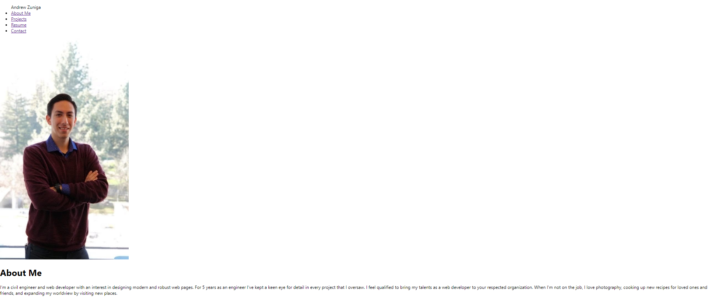

# React Portfolio

## Purpose
The task is to create a portfolio, using your new React skills to help set you apart from other developers whose portfolios don’t use the latest technologies.

### Example of Site
Deployment: https://azun510.github.io/reactPortfolio/

### Side Note
This was my third attempt at deploying to github pages. 
That will explain the lack of commits. 
Please refer to https://github.com/azun510/react-portfolio for the history of commits. 
